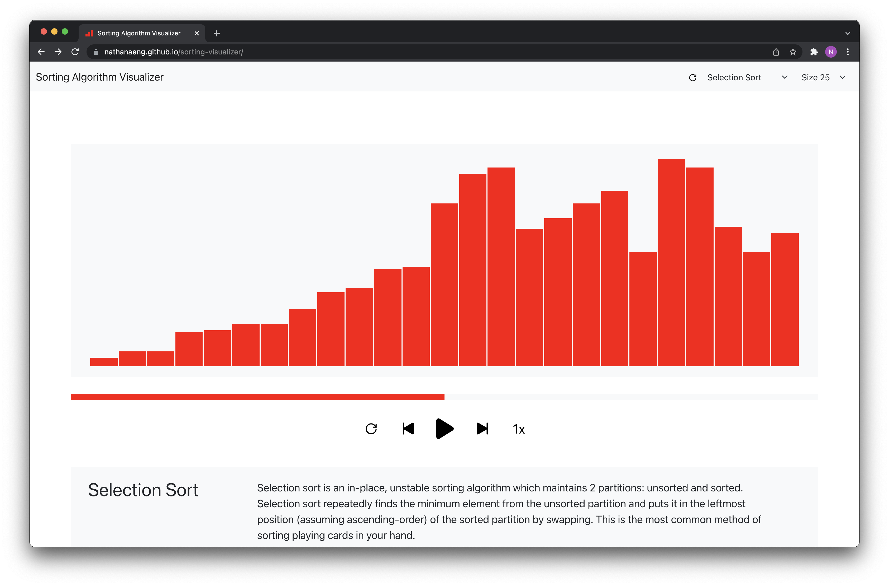

# [Sorting Visualizer](https://nathanaeng.github.io/sorting-visualizer/)
I wanted to brush up on my sorting algorithms knowledge as well as practice some React, so I made a neat little [sorting visualizer website](https://nathanaeng.github.io/sorting-visualizer/).

## Algorithms
Algorithms included are:
- Selection Sort
- Bubble Sort
- Insertion Sort
- Quick Sort
- Merge Sort
- Heap Sort

The descriptions for each algorithm are pretty basic at the moment, and will be updated soon.

## Usage
Top Bar:
- Choose a sorting algorithm from the drop-down menu at the top of the page
- Select the size of the array that you would like to sort from the drop-down menu
- Click the `refresh` symbol to randomize the array

Playback Controls:
- Press the `play` button to watch the sorting algorithm run
- Press the `back` button to go a frame backwards
- Press the `next` button to go a frame forwards
- Press the `speed` button to toggle the playback speed - the default value is `1x`
- Press the `redo` button to reset the array

## Tools Used
React, JavaScript, HTML/CSS, Bootstrap
